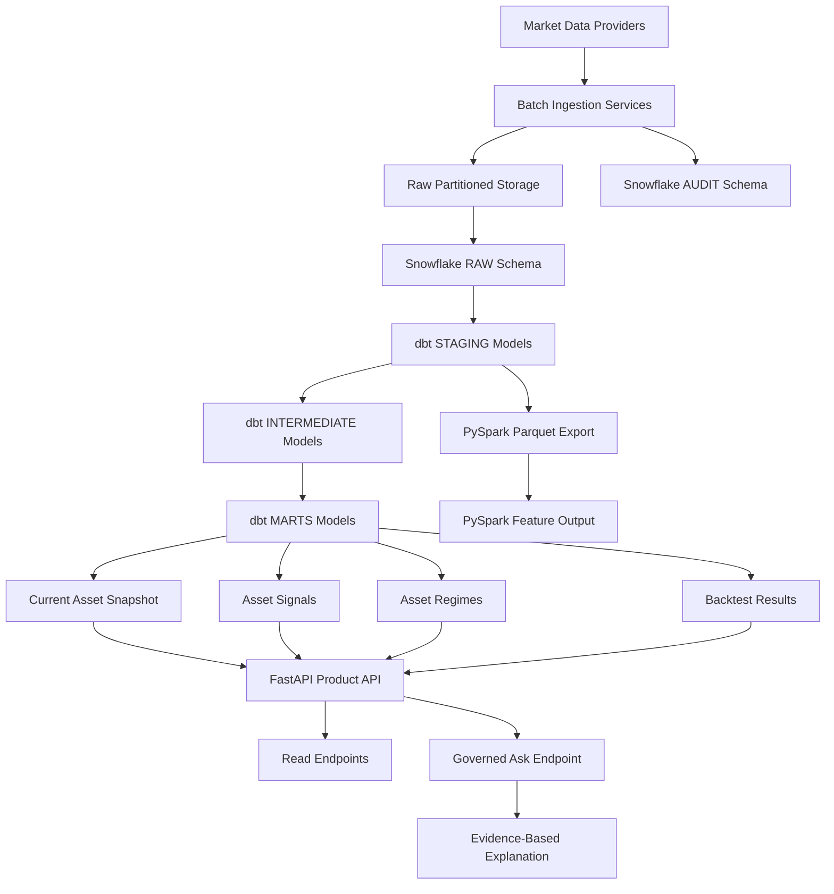
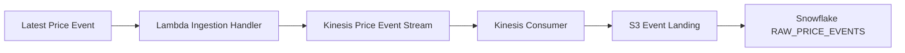

# FinSignal Platform Flow Diagram

This diagram shows the main FinSignal data flow from ingestion to product-facing explanations.

## Layer summary

| Layer | Responsibility |
| --- | --- |
| Providers | Source market data records |
| Batch ingestion | Fetch, validate, and write raw data with lineage |
| Raw storage | Preserve source-aligned files |
| Snowflake RAW | Store queryable raw records |
| Snowflake AUDIT | Store ingestion and quality metadata |
| dbt STAGING | Clean and type source-aligned data |
| dbt INTERMEDIATE | Build reusable features and classifications |
| dbt MARTS | Publish product-ready facts, signals, regimes, and backtests |
| PySpark | Generate file-oriented feature outputs over Parquet |
| FastAPI | Expose governed product endpoints |
| `/api/v1/ask` | Explain signals and regimes using modeled evidence |

## Event-ingestion side path

The event-ingestion layer is implemented as a deployment-ready side path:

AWS activation is intentionally separate from source implementation so cost-generating resources are only created through explicit operator action.
